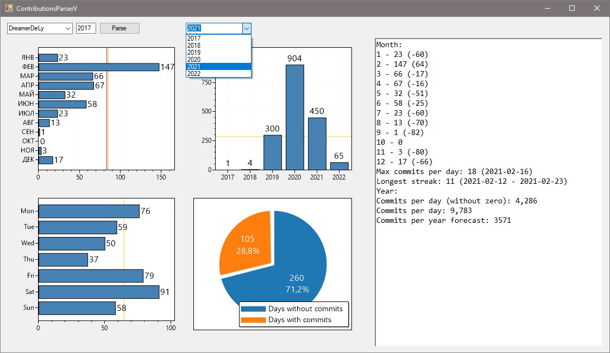

# GitHub Contributions Parser V

*Advanced tool for analyzing GitHub contributions statistics*

## Features 
* Export to CSV
* Displaying graphs 
  * Data by months
  * Data by weekdays 
  * Days with and without commits
* Displaying some statistics 
  * Longest streak
  * Day with max contributions
  * Commits per day ratio
  * Forecast

